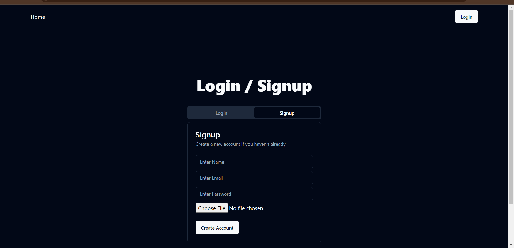
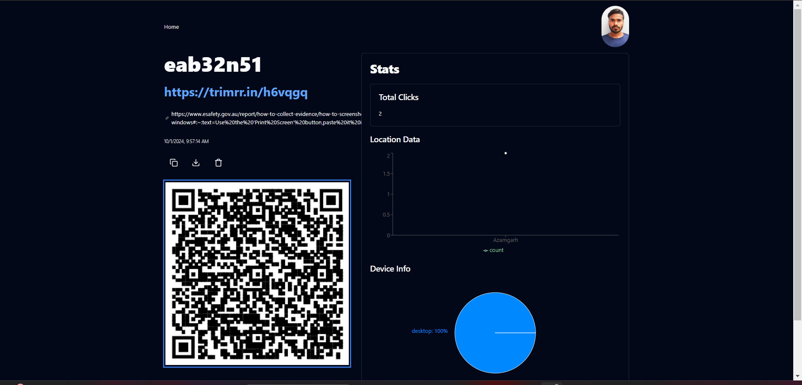
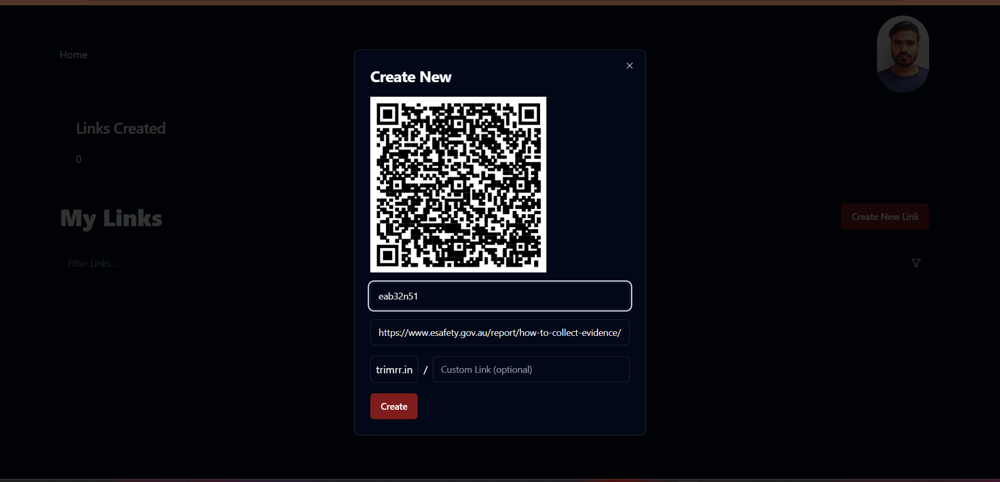

## URL Shortener Web Application
- A URL shortener application built using React.js, ShadCN UI, TailwindCSS, and Supabase. It allows users to shorten long URLs, manage them, and   get redirected to the original URLs.

# Features
- Shorten long URLs into compact, shareable links.
- User authentication via Supabase (email sign-up/sign-in).
- Responsive design using TailwindCSS.
- URL redirection using the shortened link.
- Modern and accessible UI with ShadCN components.

# Tech Stack
- Frontend: React.js, ShadCN UI, TailwindCSS.
- Backend: Supabase (PostgreSQL, Authentication).
- Build Tool: Vite.

# Getting Started
- Prerequisites
- Node.js (v14 or higher): Install Node.js
- npm or Yarn: Installed with Node.js.
- Supabase Account: For backend services like authentication and URL storage.

# Installation
- Clone the repository:
```bash    Copy code
git clone https://github.com/your-username/url-shortener.git
cd url-shortener
```
# Install dependencies:

- Using npm:

``` bash             Copy code
npm install
Or, using Yarn
```

``` bash                      Copy code
yarn install
```
# Configure environment variables

- Create a .env file in the project root directory and add your Supabase credentials:

```bash             Copy code
VITE_SUPABASE_URL=your-supabase-url
VITE_SUPABASE_ANON_KEY=your-supabase-anon-key
```
- Replace your-supabase-url and your-supabase-anon-key with your actual Supabase project's URL and anonymous key.

# Running the Application Locally
- Start the development server:

- Using npm:

``` bash   Copy code
npm run dev
Or, using Yarn
```

``` bash        Copy code
yarn dev
Your application should now be running at http://localhost:5173.
```

# Build for Production
- To create a production build:

- Using npm:

``` bash   Copy code
npm run build
Or, using Yarn
```

# Screen Short of the website







